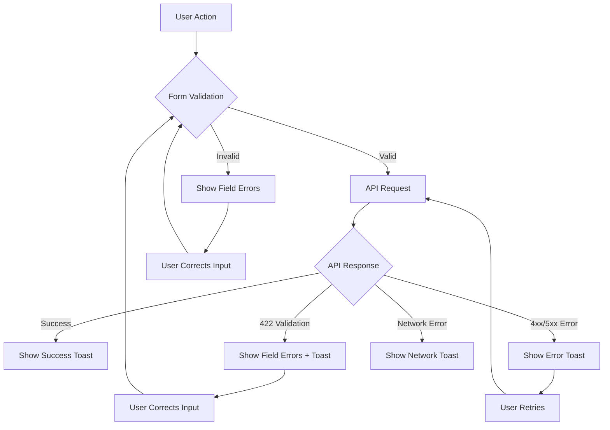

# Error Handling Flow Documentation

## Overview

This document outlines the comprehensive error handling system implemented in the Fluid Pack frontend application. The system provides consistent, user-friendly error handling across all components with proper visual feedback and toast notifications.

## Architecture

### Core Components

1. **ErrorHandlerService** - Centralized error handling with toast notifications
2. **ValidationService** - Zod-based validation with field-specific error mapping
3. **HTTP Interceptors** - Automatic error handling for API requests
4. **Form Components** - Field-level error display with visual feedback

## Error Types & Handling

### 1. Field Validation Errors (Zod)

**When**: Real-time form validation or client-side validation before API calls
**Display**: Field-level errors with visual indicators
**Toast**: ❌ No toast (prevents spam)

```typescript
// Example: Email field validation
if (error.path[0] === 'email') {
  // Shows error under email field
  // Red border, background, warning icon
  // No toast notification
}
```

**Visual Indicators**:
- Red border on input field
- Light red background
- Warning icon with error message
- Error message below field

### 2. API Validation Errors (422)

**When**: Server returns validation errors
**Display**: Field-level errors + toast notification
**Toast**: ✅ Single toast with summary

```typescript
// Backend returns 422 with field errors
{
  "errors": [
    { "field": "email", "message": "Invalid email format" },
    { "field": "password", "message": "Password too short" }
  ]
}
```

**Handling**:
- Field errors mapped to form fields
- Toast shows "Validation Error - Please check the form and try again"
- Form shows specific field errors

### 3. API Errors (4xx/5xx)

**When**: Server returns error responses
**Display**: Toast notification + form error message
**Toast**: ✅ Contextual toast based on error type

```typescript
// Error types and their handling
401: "Session expired. Please login again."
403: "You do not have permission to perform this action."
404: "Resource not found"
500: "Server error occurred. Please try again later."
```

### 4. Network Errors

**When**: Network connectivity issues
**Display**: Toast notification
**Toast**: ✅ "Network error. Please check your connection."

### 5. Authentication Errors

**When**: Token expired or invalid credentials
**Display**: Toast notification + redirect to login
**Toast**: ✅ "Authentication failed" or "Session expired"

## Implementation Flow

### 1. Request Interceptor

```typescript
// Validates request data before sending
export function requestInterceptor(req: HttpRequest<any>, next: HttpHandlerFn) {
  // 1. Add auth token
  const authReq = addAuthToken(req, authService);
  
  // 2. Validate request body with Zod
  if (req.body && shouldValidateRequest(req)) {
    const validationResult = validateRequestData(authReq, validationService);
    if (!validationResult.success) {
      // Return validation error without hitting backend
      return throwError(() => new ValidationErrorException(validationResult.errors));
    }
  }
  
  // 3. Continue with validated request
  return next(authReq);
}
```

### 2. Response Interceptor

```typescript
// Handles all response errors
export function responseInterceptor(req: HttpRequest<any>, next: HttpHandlerFn) {
  return next(req).pipe(
    // 1. Validate successful responses
    map((event: HttpEvent<any>) => {
      if (event instanceof HttpResponse) {
        return validateAndTransformResponse(event, validationService);
      }
      return event;
    }),
    
    // 2. Handle errors
    catchError(error => {
      return handleError(error, req, errorHandler, authService);
    })
  );
}
```

### 3. Error Handler Service

```typescript
@Injectable({ providedIn: 'root' })
export class ErrorHandlerService {
  // Field validation errors (no toast)
  showValidationError(errors: ValidationError[]): FormFieldErrors {
    const fieldErrors: FormFieldErrors = {};
    errors.forEach(error => {
      const fieldPath = error.path.join('.');
      if (fieldPath) {
        fieldErrors[fieldPath] = error.message;
      }
    });
    return fieldErrors; // No toast for field validation
  }
  
  // API validation errors (with toast)
  showValidationErrorWithToast(errors: ValidationError[]): FormFieldErrors {
    const fieldErrors = this.showValidationError(errors);
    this.messageService.add({
      severity: 'error',
      summary: 'Validation Error',
      detail: 'Please check the form and try again',
      life: 4000,
    });
    return fieldErrors;
  }
  
  // API errors (toast only)
  showApiError(error: ApiError): void {
    this.messageService.add({
      severity: 'error',
      summary: 'Error',
      detail: error.message,
      life: 5000,
    });
  }
}
```

## Form Component Integration

### Login Component Example

```typescript
export class LoginComponent {
  fieldErrors: FormFieldErrors = {};
  
  // Real-time validation (no toast)
  private validateFormWithZod(formValue: any) {
    const result = this.validationService.validate(formValue, userLoginSchemaDto);
    
    if (!result.success) {
      // Show field errors only
      this.fieldErrors = this.errorHandler.showValidationError(result.errors);
    } else {
      this.fieldErrors = {};
    }
  }
  
  // Form submission
  async onSubmit() {
    if (this.loginForm.invalid) {
      this.markFormGroupTouched(); // Show field errors
      return;
    }
    
    try {
      const response = await firstValueFrom(this.authService.login(loginData));
      this.errorHandler.showSuccess('Welcome back! Login successful.');
    } catch (error: any) {
      if (error.fieldErrors) {
        // Validation errors from interceptors
        this.fieldErrors = error.fieldErrors;
      } else if (error.error) {
        // API errors
        this.errorHandler.showApiError(error.error);
      }
    }
  }
}
```

## Visual Design System

### Toast Styling

```css
/* Design system integration */
.p-toast .p-toast-message {
  box-shadow: var(--shadow-medium);
  border-radius: 0.75rem;
  border: 1px solid var(--color-neutral-300);
  background: var(--color-bg);
}

.p-toast .p-toast-message.p-toast-message-error {
  border-color: var(--color-error);
}

.p-toast .p-toast-message.p-toast-message-success {
  border-color: var(--color-success);
}
```

### Field Error Styling

```css
/* Error field styling */
.error-field {
  background-color: rgba(231, 76, 60, 0.05) !important;
  border-color: var(--color-error) !important;
}

.error-field:focus {
  ring-color: rgba(231, 76, 60, 0.5) !important;
  border-color: var(--color-error) !important;
}

.error-icon {
  color: var(--color-error) !important;
}
```

## Error Flow Diagram



## Best Practices

### 1. Error Prevention
- Validate on client-side before API calls
- Use proper form validation patterns
- Provide clear field labels and placeholders

### 2. Error Display
- Show field errors immediately for validation
- Use toasts for API errors and success messages
- Avoid duplicate error displays
- Provide clear, actionable error messages

### 3. User Experience
- Progressive validation (only after user interaction)
- Clear visual indicators for error states
- Consistent error styling across components
- Proper loading states during API calls

### 4. Developer Experience
- Centralized error handling service
- Type-safe error interfaces
- Consistent error handling patterns
- Easy to extend and maintain

## Usage Examples

### Adding Error Handling to New Component

```typescript
export class NewComponent {
  fieldErrors: FormFieldErrors = {};
  
  constructor(
    private errorHandler: ErrorHandlerService,
    private validationService: ValidationService
  ) {}
  
  // Handle form validation
  validateForm(data: any, schema: z.ZodSchema) {
    const result = this.validationService.validate(data, schema);
    if (!result.success) {
      this.fieldErrors = this.errorHandler.showValidationError(result.errors);
    }
  }
  
  // Handle API errors
  async submitForm() {
    try {
      const response = await this.apiService.post('/endpoint', this.formData);
      this.errorHandler.showSuccess('Operation successful!');
    } catch (error) {
      this.errorHandler.showApiError(error.error);
    }
  }
}
```

### Custom Error Handling

```typescript
// For specific error scenarios
handleCustomError(error: any) {
  if (error.code === 'SPECIFIC_ERROR') {
    this.errorHandler.showWarning('Custom warning message');
  } else {
    this.errorHandler.showApiError(error);
  }
}
```

## Configuration

### Toast Configuration

```typescript
// Toast message configuration
const toastConfig = {
  severity: 'error' | 'success' | 'warn' | 'info',
  summary: string,
  detail: string,
  life: number, // milliseconds
};
```

### Validation Configuration

```typescript
// Zod schema validation
const schema = z.object({
  email: z.string().email('Invalid email format'),
  password: z.string().min(6, 'Password must be at least 6 characters'),
});
```

## Troubleshooting

### Common Issues

1. **Duplicate Toasts**: Ensure field validation doesn't trigger toasts
2. **Missing Error Messages**: Check if error paths are correctly mapped
3. **Styling Issues**: Verify CSS variables are properly defined
4. **Validation Not Working**: Ensure Zod schemas are correctly imported

### Debug Tips

```typescript
// Enable debug logging
console.log('Validation errors:', errors);
console.log('Field errors:', this.fieldErrors);
console.log('API error:', error);
```

## Future Enhancements

1. **Error Analytics**: Track error patterns and frequency
2. **Retry Logic**: Automatic retry for transient errors
3. **Offline Support**: Handle offline scenarios gracefully
4. **Error Recovery**: Smart error recovery suggestions
5. **A11y Improvements**: Better screen reader support for errors

---

**Last Updated**: December 2024
**Version**: 1.0.0
**Maintainer**: Frontend Team
